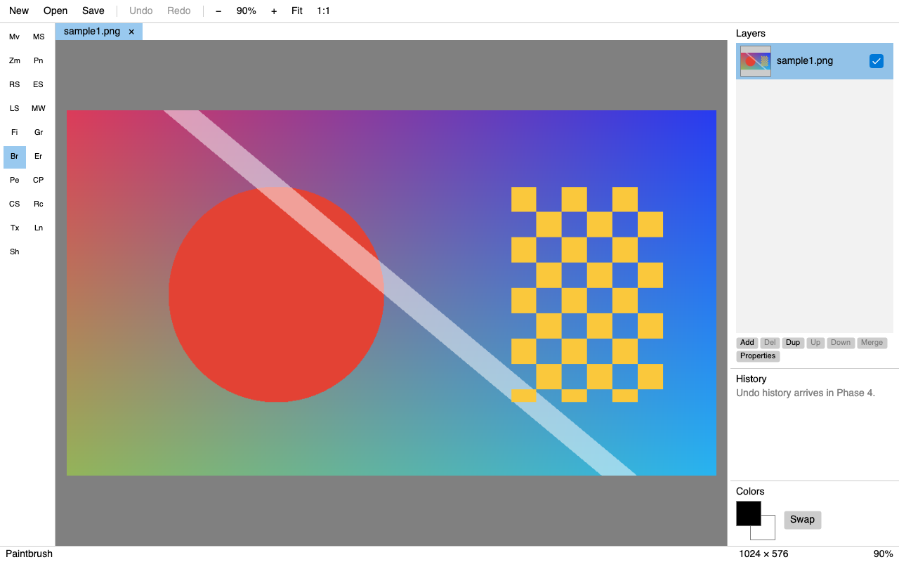

# CinnabarSharp

A cross-platform image editor inspired by [Paint.NET](https://www.getpaint.net/), written in C# with .NET 10 and [Avalonia](https://avaloniaui.net/). It runs on Windows, macOS and Linux with the same rendering on all three.

> **Status: early development.** Documents, layers, file formats, undo/redo, selections, clipboard, painting and text tools, the Image menu, adjustments, effects, photo tools and the MCP server for AI agents work; the UI review is in progress. See the [roadmap](tasks.md).



## Features

- **Multiple images in tabs**, with unsaved-changes prompts on close and quit.
- **Layers**: add, delete, duplicate, reorder, merge down, flatten, import from file, flip; per-layer visibility, opacity and blend mode (Paint.NET's 14 modes plus Hard Light and Soft Light), with live preview in Layer Properties.
- **File formats**: PNG, JPEG, BMP, GIF, TIFF, WebP, and OpenRaster (`.ora`) to keep layers; HEIC/HEIF photos can be opened (not saved: no HEVC encoder is available). Files are recognised by content when the extension is missing or wrong, and photos with a color profile (e.g. iPhone Display P3) are converted to sRGB.
- **Undo/redo** with a History panel (click a step to jump to it).
- **Selections**: rectangle, ellipse, lasso and magic wand with Paint.NET's modes (replace, union, exclude, xor, intersect), marching ants, move selection / selected pixels, crop to selection, erase, fill; cut/copy/paste with the system clipboard.
- **Painting**: paintbrush (hardness, pen pressure), pencil, eraser, clone stamp, recolor, paint bucket, color picker, line/curve with editable Bézier handles, rectangle/rounded rectangle/ellipse shapes and gradients (linear, radial, diamond, conical; color or transparency mode), with primary/secondary colors and a color dialog.
- **Text**: system fonts, size, bold, italic, underline, alignment; the text stays editable (caret, selection, clipboard, style changes) until you finish it.
- **Adjustments**: auto-level, black and white, brightness/contrast, curves, hue/saturation, invert, levels (with histograms and per-channel mode), posterize, sepia — with live preview.
- **Effects**: Gaussian/motion/radial/zoom blur, glow, sharpen, vignette, add noise, median, bulge, frosted glass, pixelate, twist, edge detect, emboss, relief, clouds, Mandelbrot — with live preview and Repeat Last Effect.
- **Photo menu** (iPhone-like): Auto-Enhance, Adjust Photo (exposure, brilliance, highlights, shadows, contrast, brightness, black point, saturation, vibrance, warmth, tint, sharpness, definition, noise reduction, vignette), filters with thumbnails (Vivid, Dramatic, Mono, Silvertone, Noir…), Straighten; hold to compare before/after.
- **Photos for the TV**: crop tool locked to 16:9 (or 4:3, 3:2, 1:1…), Prepare for TV at 2K, 4K or 8K (crop to fill, fit with plain or blurred borders, two portraits side by side), JPEG export with quality and sRGB profile, and a whole folder at once.
- **Image menu**: resize image (resampling choice), canvas size with anchor, rotate, flip, crop to selection.
- **Zoom and pan** like Paint.NET: zoom presets, best fit, Ctrl/⌘ + wheel and trackpad pinch around the mouse, pan with Space + drag, middle mouse or the Pan tool.
- **AI agents (MCP)**: Claude Code, Claude Desktop and other MCP clients can open, edit and save images, headless (`CinnabarSharp --mcp`) or in the running app while you watch (`--mcp --attach`). File access is limited to allowed folders, and every edit can be undone. See [docs/mcp.md](docs/mcp.md).
- **Native feel on each OS**: macOS menu bar and ⌘ shortcuts, in-window menu and Ctrl shortcuts on Windows and Linux, native file dialogs, drag and drop, recent files.

## Download

Pre-built packages for Windows, macOS (Apple Silicon and Intel) and Linux are attached to each [release](https://github.com/pgourlain/CinnabarSharp/releases). They are self-contained (no .NET install needed) but not yet signed:

- **Windows**: unzip and run `CinnabarSharp.exe` (SmartScreen may warn: *More info → Run anyway*).
- **macOS**: unzip and open `CinnabarSharp.app`; the first time, right-click → *Open* (or `xattr -dr com.apple.quarantine CinnabarSharp.app`).
- **Linux**: extract and run `./CinnabarSharp`.

## Build and run

Requires the [.NET 10 SDK](https://dotnet.microsoft.com/download).

```bash
dotnet run --project CinnabarSharp.Desktop            # start the app
dotnet run --project CinnabarSharp.Desktop -- a.png   # open files at startup
dotnet test CinnabarSharp.slnx                        # run all tests
packaging/package.sh osx-arm64 0.1.0                  # build a package (win-x64, linux-x64, osx-arm64, osx-x64)
```

Pushing a tag such as `v0.1.0` builds the packages for every OS and publishes a GitHub release.

## Project layout

| Project | Contents |
|---|---|
| `CinnabarSharp.Core` | Document model, layers, compositing, file formats. No UI code; builds and tests without any UI framework. |
| `CinnabarSharp.Mcp` | MCP server (tools, resources, allowed folders), built on Core only; hosted by the desktop executable with `--mcp`. |
| `CinnabarSharp.Desktop` | Avalonia desktop app (MVVM). |
| `CinnabarSharp.Core.Tests` | Unit tests, including a checksum test that keeps blend modes bit-identical on every OS. |
| `CinnabarSharp.Desktop.Tests` | Headless UI tests that drive the real window and save screenshots. |
| `CinnabarSharp.Mcp.Tests` | Integration tests that start `CinnabarSharp --mcp` and drive it over stdio like an agent. |

CI builds and tests on Windows, macOS and Linux, and publishes the UI screenshots of each OS as artifacts so they can be compared.

## Credits and license

MIT — see [LICENSE](LICENSE).

Parts of the code are ported from [Pinta](https://github.com/PintaProject/Pinta) (MIT), whose original copyright headers are kept in those files. Image decoding and encoding use [Magick.NET](https://github.com/dlemstra/Magick.NET).
